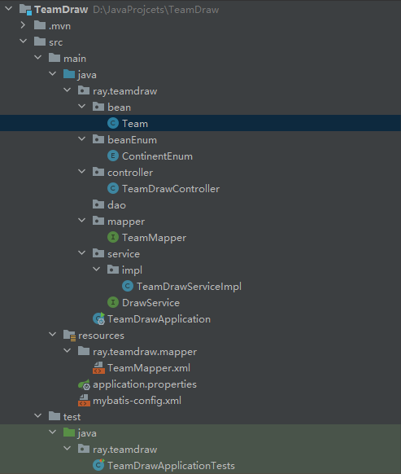
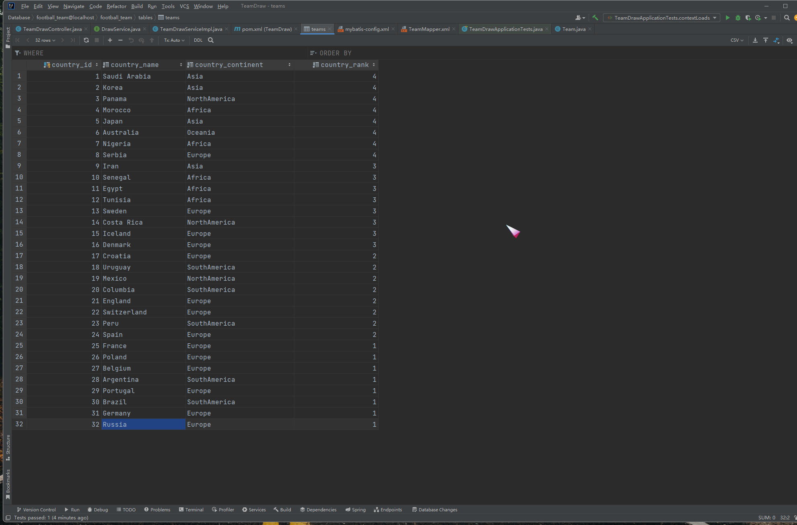

# WorldCupTeamDraw

##### Each World Cup selects 32 first-class teams from national teams around the world, which are then divided into eight groups during the tournament

#### This program accesses a database of qualified 32 teams and divides them into eight groups according to the following rules:

1. The 32 teams are divided into 4 tiers according to the standings, with 8 teams in each tier (read directly from the database).
2. The 32 teams come from different continents, so the World Cup draw has the principle of continental avoidance, which means no more than two teams from the same continent in each group.
3. As the host country, their national team will be ranked first in the first group, and the host team will have a fixed level of one.

## Coding implementation

### java class structure:

### Database content:

### key algorithm:

```java
private List<Team> getTeamsNotFromAssignContinents(Set<ContinentEnum> continents, List<Team> level) {
        List<Team> filteredTeams = Lists.newArrayList();
        int continentsCount;
        for (Team team : level) {
            continentsCount = continents.size();
            for (ContinentEnum continent : continents) {
                if ( team.getCountryContinent().equals(continent)){
                    --continentsCount;
                    break;
                }
            }
            // 此时仍然相等表明该国家球队不来自continents中的任何一个洲
            if (continentsCount == continents.size()) {
                filteredTeams.add(team);
            }
        }
        return filteredTeams;
    }
```


```java
private Set<ContinentEnum> getCurrentGroupAvoidanceContinents(List<Team> group) {
        Set<ContinentEnum> set = Sets.newHashSet();
        Map<ContinentEnum, Integer> avoidanceCount = Maps.newHashMap();
        for (Team team : group) {
            if (avoidanceCount.containsKey(team.getCountryContinent())){
                Integer value = avoidanceCount.get(team.getCountryContinent()) + 1;
                avoidanceCount.put(team.getCountryContinent(), value);
            }else {
                avoidanceCount.put(team.getCountryContinent(), 1);
            }
        }
        for (Map.Entry<ContinentEnum, Integer> continentEnumIntegerEntry : avoidanceCount.entrySet()) {
            if (continentEnumIntegerEntry.getValue() >= 2) {
                set.add(continentEnumIntegerEntry.getKey());
            }
        }
        return set;
    }
```


